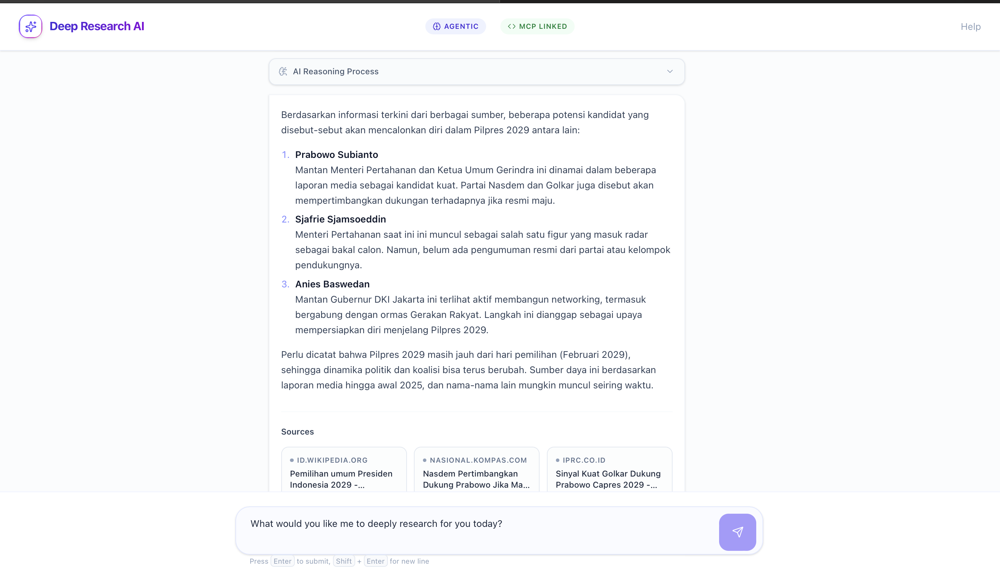

# Deep Research Agent Website




A full-stack web application featuring a Deep Research Agent capable of profound web research, data aggregation, and real-time reasoning display. Built with a modern, responsive UI and a robust Python backend leveraging Model Context Protocol (MCP) and advanced language models.

## ✨ Features

- **Real-Time Reasoning & Typing Effect**: Watch the AI's thought process unfold in real-time with a smooth typewriter effect.
- **Deep Web Research**: Integrates with web search tools to gather comprehensive data and sources.
- **Model Context Protocol (MCP) Integration**: Extensible tool execution via an MCP server.
- **Modern UI/UX**: Built with React, Tailwind CSS, and polished animations for an immersive user experience.
- **Robust Error Handling**: Gracefully handles API failures and JSON parsing issues.

## 🚀 Tech Stack

- **Frontend**: React, Vite, Tailwind CSS, TypeScript
- **Backend**: FastAPI, Python, LangChain, Model Context Protocol (MCP)
- **AI Models**: Designed to work with powerful LLMs (e.g., NVIDIA Llama 3.3 Nemotron Super, OpenRouter models).

## 🛠️ Getting Started

### Prerequisites

- Node.js (v18+)
- Python 3.10+

### Backend Setup

1. Navigate to the backend directory:
   ```bash
   cd backend
   ```
2. Create and activate a virtual environment:
   ```bash
   python -m venv venv
   source venv/bin/activate  # On Windows: venv\\Scripts\\activate
   ```
3. Install dependencies:
   ```bash
   pip install -r requirements.txt
   ```
4. Configure environment variables (create a `.env` file in the backend folder):
   ```env
   NVIDIA_API_KEY=your_nvidia_api_key_here
   ```
5. Run the backend server:
   ```bash
   fastapi dev api.py
   ```

### Frontend Setup

1. Navigate to the frontend directory:
   ```bash
   cd frontend
   ```
2. Install dependencies:
   ```bash
   npm install
   ```
3. Start the Vite development server:
   ```bash
   npm run dev
   ```

## 📄 License

This project is open-source and available under the MIT License.
